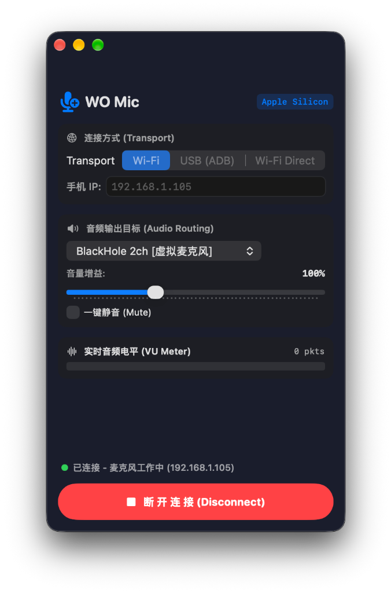
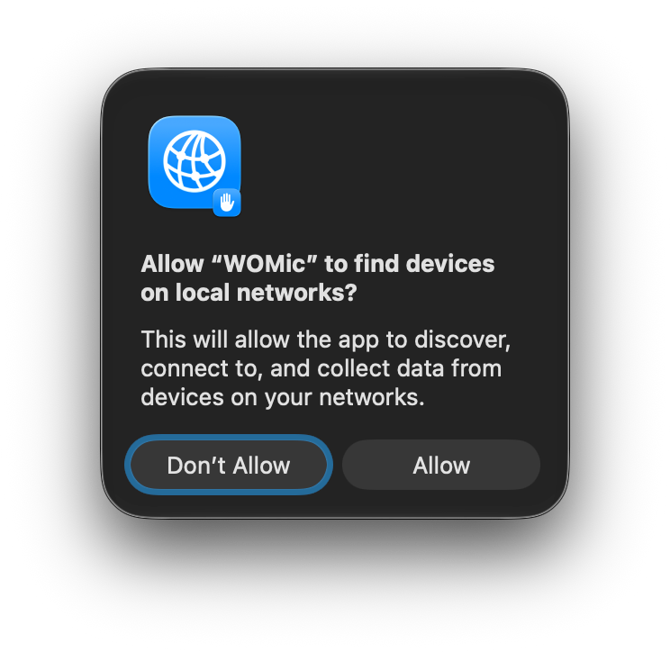
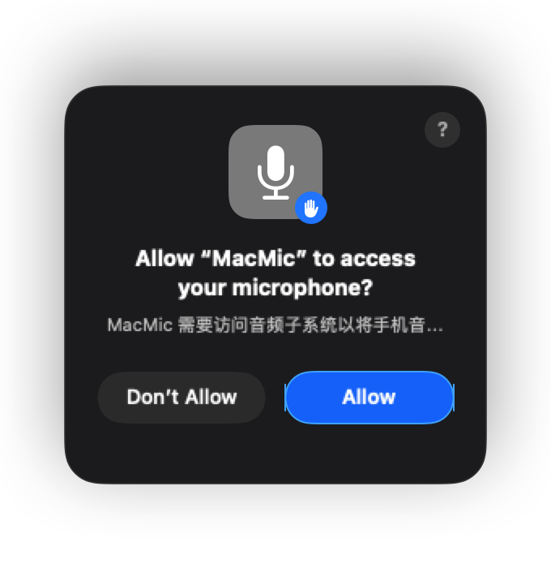

# MacMic for Mac (Unofficial)

Language: **English** | [简体中文](README_ZH.md)

**MacMic** is an unofficial native macOS audio client built for Apple Silicon (M-series chips), compatible with the WO Mic communication protocol. Written in pure Swift / SwiftUI, it features a lightweight footprint, fast cold start, and routes phone microphone audio directly into **BlackHole 2ch** virtual audio device.

> **📌 Architecture Note**  
> Currently, the pre-built application binary supports **Apple Silicon (M1/M2/M3/M4 series chips)**. Let me know if you need an Intel version.

> **💻 Windows Users Note**  
> This project will **NOT** provide a Windows version. Windows users please support and use the official software by Wolicheng Tech: [https://wolicheng.com/womic/](https://wolicheng.com/womic/).

> **Disclaimer & Note to WO Mic Developers**  
> 1. **Unofficial Port**: This project is an independent open-source port and has no affiliation, sponsorship, or endorsement from Wolicheng Tech. **Please DO NOT ask the developers of WO Mic for help regarding this unofficial port.**  
> 2. **To Developers of WO Mic**: We deeply appreciate Wolicheng Tech's work on WO Mic. This software is created solely for macOS interoperability research and personal convenience. If Wolicheng Tech does not approve of this port or has any concerns, please contact `noonyjufee@gmail.com`. The repository will be immediately taken down upon request.  
> 3. **Trademarks**: All trademarks, brand names, and protocol copyrights related to WO Mic belong to Wolicheng Tech.


---

## Key Highlights

Official WO Mic support has long lacked a clean native client for macOS. Previously, using WO Mic on Mac required Wine, virtual machines, or fragile Python scripts, often suffering from audio latency, popping, or disconnects.

MacMic directly implements low-level network communication and CoreAudio pipelines in Swift, statically linking `libopus` with zero runtime dependencies.

---

## Features

- **Three Connection Modes**:
  - **Wi-Fi**: Wireless connection over local network (supports iOS & Android).
  - **USB (ADB)**: Plug in Android phone for automatic ADB port forwarding with ultra-low latency.
  - **Wi-Fi Direct**: Direct hotspot connection.
- **Audio Routing & Processing**:
  - Auto-detects and outputs audio into **BlackHole 2ch** virtual microphone.
  - Real-time logarithmic dB VU meter.
  - 0% to 300% gain adjustment and one-click mute.
- **Internationalization (9 Languages Supported)** 🌐:
  - Full native i18n support with instant dynamic switching:
    - 🇨🇳 **简体中文** (Simplified Chinese)
    - 🇭🇰 **繁體中文** (Traditional Chinese)
    - 🇺🇸 **English**
    - 🇯🇵 **日本語** (Japanese)
    - 🇰🇷 **한국어** (Korean)
    - 🇪🇸 **Español** (Spanish)
    - 🇫🇷 **Français** (French)
    - 🇷🇺 **Русский** (Russian)
    - 🇩🇪 **Deutsch** (German)
  - Automatically matches macOS system language or customizes in Preferences.
- **macOS Native Integration**:
  - Menu Bar resident mode with quick status popover controls.
  - Supports Light, Dark, and System appearance themes.
  - Launch at Login option (powered by Apple's `SMAppService`).
- **Native & Lightweight**: Single standalone binary without background daemons.

---

## Usage

Mobile app setup is identical to the official connection procedure. Here are the step-by-step instructions:

### 1. Install Virtual Audio Driver (BlackHole)
macOS does not allow applications to inject audio directly into other apps' microphone input. Therefore, a virtual audio driver like **BlackHole 2ch** is required.

Install via Homebrew:
```bash
brew install blackhole-2ch
```
Or download the installer from the [BlackHole Website](https://existential.audio/blackhole/).

### 2. Mobile App Setup

#### iOS (iPhone)
1. Download and open **WO Mic** from the App Store.
2. Connect your iPhone and Mac to the same Wi-Fi network.
3. In WO Mic settings, set **Transport** to **Wi-Fi** (*Note: WO Mic for iOS officially supports Wi-Fi mode only*).
4. Tap the Play button at the top and note the IP address shown on screen (e.g., `192.168.1.105`).

#### Android
- **Wi-Fi Mode**: Same steps as iOS.
- **USB Mode**:
  1. Enable **USB Debugging** under Developer Options on your Android device.
  2. Connect to Mac via USB cable, set Transport to **USB** in WO Mic app, and tap Play.
  3. Select **USB (ADB)** mode in MacMic client and click Connect (ADB forwards port 8125 automatically).

### 3. Mac Client Connection

1. Download `MacMic.app` from Releases, move it to `/Applications`, and open it.
2. In the **Audio Routing** dropdown, select **`BlackHole 2ch [Virtual Microphone]`**:

   

3. Enter your phone's IP address (or select the appropriate Transport mode) and click **Connect**.
4. **⚠️ System Permissions Requirement**: When clicking Connect for the first time, macOS will present two system permission dialogs as shown below. **You MUST click "Allow" on BOTH popups**. Declining will block network traffic or microphone audio output:

   | Local Network Permission | Microphone Access Permission |
   | :---: | :---: |
   |  |  |

### 4. Input Source & Global Audio Management

- **Basic Setup**: Open WeChat, Zoom, Teams, OBS, or macOS System Settings -> Sound, and select **BlackHole 2ch** as your Microphone (Input Device).
- **Recommended Advanced Tool (FineTune)**:  
  For per-app audio input routing and comprehensive system-wide volume control, we recommend pairing MacMic with **FineTune**, a free menu-bar audio utility for macOS.  
  - Repository: [https://github.com/ronitsingh10/FineTune](https://github.com/ronitsingh10/FineTune)

---

## Building from Source

### Prerequisites
- macOS 12.0+ (Apple Silicon)
- Xcode Command Line Tools (`xcode-select --install`)
- libopus (`brew install opus`)

### Build Command
```bash
git clone https://github.com/luanyufei/MacMic.git
cd MacMic
./build_app.sh
```
The compiled `MacMic.app` bundle will be generated in the root directory.

---

## Source Layout

```text
swift-src/
├── main.swift                 # Application entrypoint & window styling
├── ContentView.swift          # SwiftUI interface & VU meter rendering
├── ViewModel.swift            # State management & event dispatching
├── WOMicClient.swift          # Communication protocol implementation
├── AudioEngine.swift          # CoreAudio / AudioQueue output engine
├── OpusDecoder.swift          # C libopus decoding wrapper
├── AudioDeviceManager.swift   # macOS audio device enumeration
├── ADBHelper.swift            # Android USB ADB port forwarding helper
├── MenuBarManager.swift       # Menu bar icon & quick action popover
├── SettingsView.swift         # Multi-language & autostart preferences
├── Localization.swift         # Multi-language i18n support
└── LaunchAtLoginHelper.swift  # SMAppService login item manager
```

---

## License

Distributed under the [MIT License](LICENSE).
